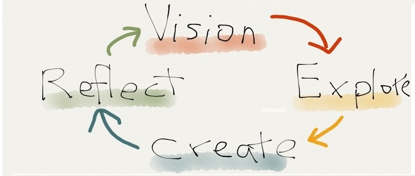
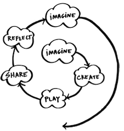
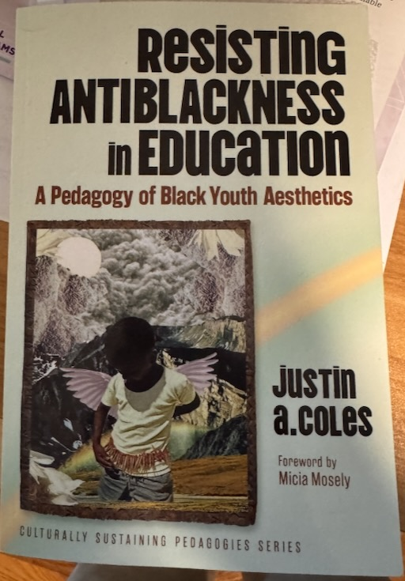
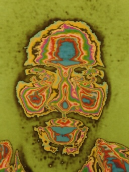
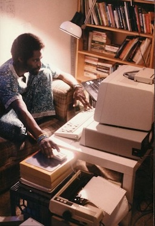

# CCCHBK

## Creative Computing Club House Brooklyn

CCCHBK, Creative Computing Club House Brooklyn,  
is the embodiment of a vision of learning that is

- project based
- passsion driven
- shared with peers
- playful
    
- coming in persion in free spaces this summer 2026
- in brooklyn 11201, 11234,
- and global via the World Wide Web.

## Grounding

- [Nina Simone: That Blackness](https://molab-itp.github.io/moSalon/src/videoplayer/?playlist=c3ClwX7oyXk)
  - where is the source?
- [W. E. B. Du Bois, ‘Black America’, 1932](https://credo.library.umass.edu/cgi-bin/pdf.cgi?id=scua:mums312-b229-i058)
  - [source: breakfast-with-du-bois](https://duboiscenter.library.umass.edu/breakfast-with-du-bois/)

## Learning

- [refections-on-learning](https://johnhenrythompson.com/johnhenrythompson/0-refections-on-learning.html)
- [play-to-learn](https://johnhenrythompson.com/johnhenrythompson/the-art-of-learning/play-to-learn.html)
- [youtube LifelongKindergarten/videos](https://www.youtube.com/@LifelongKindergarten/videos)
- [Youth Activism and Advocacy](https://www.media.mit.edu/projects/youth-activism-and-advocacy/overview/)
- [Computing for a Purpose](https://www.media.mit.edu/projects/purpose-based-creative-computing-with-scratch/overview/)
  - [jaleesa-trapp-leveraging-lived-experience](https://mitchresnick.substack.com/p/jaleesa-trapp-leveraging-lived-experience) - on substack
  - [Jaleesa Trapp: Leveraging Lived Experience](https://www.youtube.com/watch?v=LbXY1pTO8jo) - on youtube
  - [Scratch coding](https://scratch.mit.edu/)
  - [octostudio](https://octostudio.org/)
- [Connecting Through Comics](https://www.media.mit.edu/projects/connecting-through-comics-co-creating-a-collage-based-digital-system-for-expressing-complex-emotions-with-and-for-trauma-impacted-youth/overview/)
- [CoCo — A New Real-Time Co-Creative Platform for Young People](https://www.media.mit.edu/projects/cocobuild/overview/)

- [future-sketches](https://www.media.mit.edu/groups/future-sketches/overview/)

## Inspiration

- [Seymour Papert](https://jht1493.net/johnhenrythompson/0-refections-on-learning.html)
- [Lifelong Kindergarten](https://www.media.mit.edu/groups/lifelong-kindergarten/overview/)

